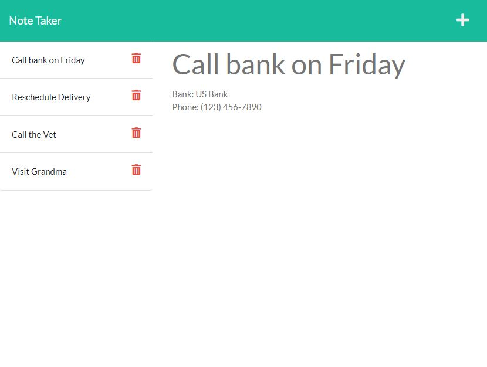
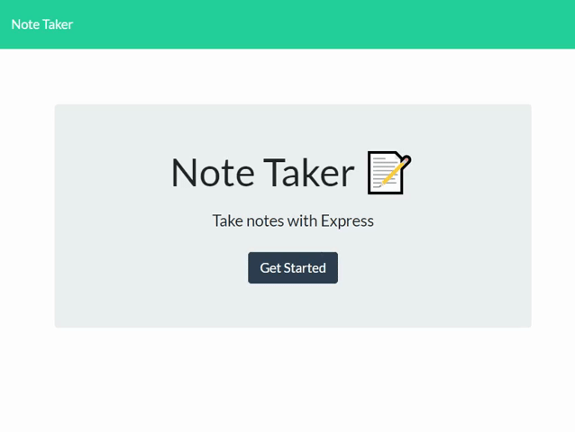
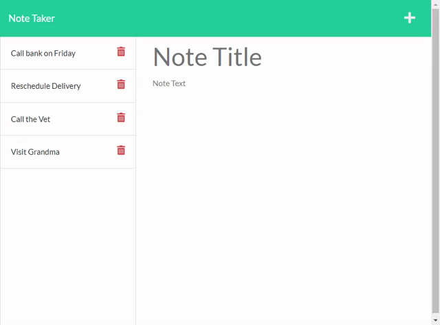

# Note Taker

## Table-of-Contents

- [Description](#description)
- [Deployed Site](#deployed-site)
- [Features](#features)
- [Technologies](#technologies)
- [Future Development](#future-development)
- [Credits](#credits)

## Description

This is my eleventh challenge assignment for the University of Oregon Coding Bootcamp 2022. The challenge is to create an application called Note Taker that can be used to write and save notes. This app will use an Express.js back end and will save and retrieve data from a JSON file as a database.

## Deployed Site

Follow [this link](https://calm-sierra-01741.herokuapp.com/) to view and use my site!

## Features

When users open this web application, they are met with a standard landing page. Clicking the "Get Started" button will direct the user to a page that displays all of their current notes.

The users are able to view the titles of all of their notes on the left-hand side of the screen. When clicking on a note, it displays its full text contents on the main portion of the page. If a user wishes to delete a note, they can click on the trash icon next to the note they wish to delete.

If a user wishes to create a new note, they can click on the plus icon located in the top right. This will create an editable text field in the main portion of the page where users can type their desired notes. To save this new note, users must click on the save icon located in the top right. This adds the new note to the bottom of the current existing notes.

## Technologies

- HTML
- CSS
- JavaScript
- Node.js

## Future Development

In the future, I would like to add the following improvements:

- A feature that allows users to edit an existing note.
- A button that allows users to delete all notes.
- Some kind of checkbox system that allows users to select multiple notes for deletion or sorting.
- A file or organizational system in which users can sort their notes.

I'm always interested in refactoring code to improve it's functionality. If you would like to suggest your own improvements, you can reach me at the links below.

- <a href="mailto:ashlynn4567@gmail.com">Email</a>
- <a href="https://github.com/ashlynn4567">GitHub</a>
- <a href="https://www.linkedin.com/in/ashley-lynn-smith/">LinkedIn</a>

## Credits

This project was built with the help of the University of Oregon's Coding Boot Camp.

## Licensing

The application is covered under the following license: [MIT](https://opensource.org/licenses/MIT)
